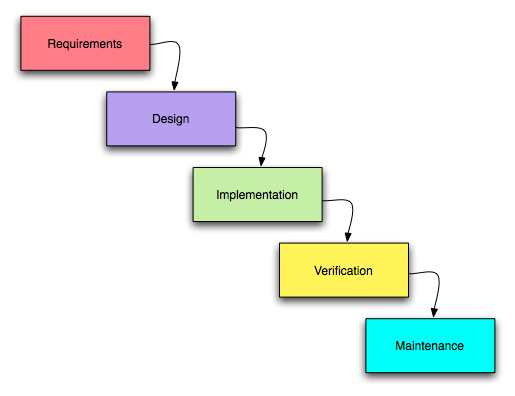
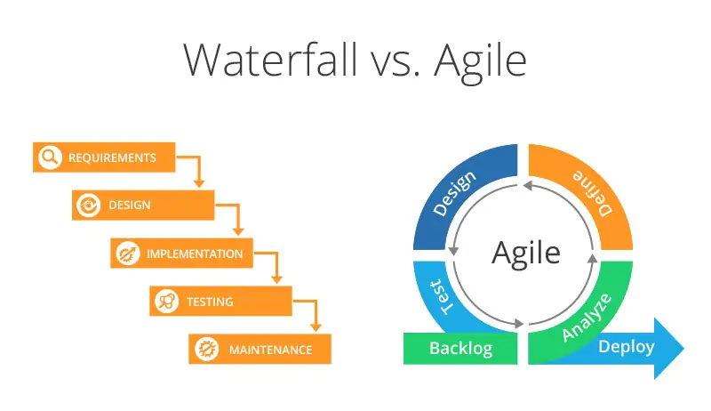

1. Software Development Life Cycle (SDLC), Software Testing Life Cycle (STLC) methodologies: Waterfall, Agile.

WATERFALL: linijinis, lėtas
    requirements:
        customer req (important to QA), system req, software specification req
    design: architektūra
    implementation: programinės įrangos kūrimas
    verification: testuojame
    maintenence: priežiūra

AGILE: judrus, lankstus

2. Test Cases (TC)
    Test Scenarios (TS)
        Registration for person
        Registration for company
        Login
        Forgot password
        Logout

        To-Do scenario:
            TS01 Create new task
            TS02 Delete task
            TS03 Edit task
            TS04 Task calculation
            TS05 Filtering functionality

        To-Do test case:
            TS01 Create new task
                TC01.01 Positive create new task
                    1. open app
                    2. input task name: clean room
                    3. pess key [Enter]
                    Expected result: task available in the list of tasks
                    Status (Pass/Fail): Pass
                    Actual result:

            TS01 Create new task
                TC01.02 Positive create new task with LT words
                    1. open app
                    2. input task name: Nupjauti žolę
                    3. pess key [Enter]
                    Expected result: task available in the list of tasks
                    Status (Pass/Fail): Fail
                    Actual result: app crashed (is not available in the list)

www.testsigma.com/guides/test-cases-for-manual-testing/

TC mandatory fields:
    test case ID,
    test case description,
    steps to follow,
    expected results,
    pass/fail criteria, and
    status of the test case

3. Git for team:
    branching, merge, pull requests

