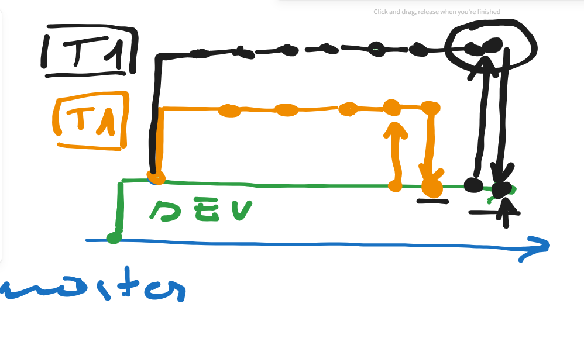

## I. Git for team: branching, merge, pull requests

CLI - Command Line Interface

Pradejus versijavima projekto katolage sukuria papildoma kataloga '.git'



```git
    git init

    git status
    git add .
    git commit -m "Initial commit"

    git log - commit'ų sąrašas

    git branch - pasiimti branch'ų sąrašą
    git checkout -b "dev" - sukuriama naują branch'ą
    git branch - pasiimti branch'ų sąrašą

    git checkout -b "branch_B"
    git checkout -b "branch_A"
    git branch

    git merge branch_B - kai esame prisijungę prie branch_A
    git commit -m "Merge message"

```

Visada sukuriama master (main) šaka

[Branching](https://learngitbranching.js.org/)

## II. Smoke test

    Functional/non-Functional

    Regression testing

    Smoke test:

        - patikrinti, ar aplikacija tinkama testuoti
        - Happy path -> įvedame positive/teisingą info
        - Tik pagrindines f-jas
        - Šalutinių f-jų netestuojame

    Smoke testai (dar žinomi kaip build verification testai) – tai pirmieji testai, atliekami po naujo programinės įrangos build'o ar versijos sukūrimo, siekiant užtikrinti, kad pagrindinės f-jos veikia ir sistema nėra visiškai sugedusi. Tai yra greita ir paviršutinė testavimo forma, kuri netikrina išsamiai visų funkcionalumų, bet patikrina, ar sistemoje nėra didelių klaidų, kurios užkirstų kelią tolesniam testavimui.

    https://todolist.james.am/#/

    Pagrindinės f-jos:

        1. Create new task
        2. Delete task
        3. Edit task
        4. Mark tasks as completed
        5. View task list

    Šalutinės f-jos:

        1. Search tasks: Search for specific tasks in the list.
        2. Filter tasks: Show only active, completed, or overdue tasks.
        3. Sort tasks: Organize tasks based on priority or due date.
        4. Notifications/reminders: Alert users to upcoming deadlines or tasks.
        5. Save tasks: Ensure tasks are saved even after the application is closed or refreshed.


## III. Exploratory testing

    Exploratory testing (angl. Eksploraciniai testai) – tai testavimo metodas, kai testuotojai tiria programinę įrangą be iš anksto paruoštų testų scenarijų, naudojant savo žinias apie sistemą, intuiciją ir kūrybiškumą. Testuotojas aktyviai "tyrinėja" programą, ieškodamas klaidų, netikėtų rezultatų ar nesuderinamumų, dažnai remiasi savo patirtimi ir produktyvumu, kad nustatytų potencialias problemas.

    Eksploraciniai testai dažniausiai naudojami tada, kai:

        - Yra laiko spaudimas ir nėra pakankamai laiko sukurti išsamius testų scenarijus.
        - Nėra aiškių specifikacijų arba kai programa nėra visiškai išbaigta.
        - Testuotojas nori greitai suprasti, kaip sistema veikia ir kaip ją galima panaudoti įvairiais būdais.
        - Nėra automatizuotų testų, todėl reikia atlikti testavimą žmogaus iniciaty

## IV. Test plan

    1. TS, TC
    2. in Scope/ out of Scope: Defines what will be tested (features, systems) and what is out of scope.
    3. Environment (QA/DEV):
        - sertificates
        - equipment: servers, mob., client equipment.
    4. Exit criteria: Conditions required to conclude testing (e.g., all critical bugs resolved, test coverage achieved).
    5. Mitigation matrix:
        - Identifies potential risks (e.g., resource constraints, tight deadlines).
        - Mitigation strategies to handle risks proactively.
    6. Requirements
    7. .....
   
https://strongqa.com/qa-portal/testing-docs-templates/test-plan  
https://strongqa-production-assets.s3.amazonaws.com/uploads/document/doc/61/test-plan-template-05.pdf  
https://qatestlab.com/assets/Uploads/QATestLab-Testplan-Project-Name.pdf  

## V. TC management systems (Testomat)

https://app.testomat.io/users/sign_in?info=You+must+be+logged+in+to+access+this+page+
https://coffee-cart.app/