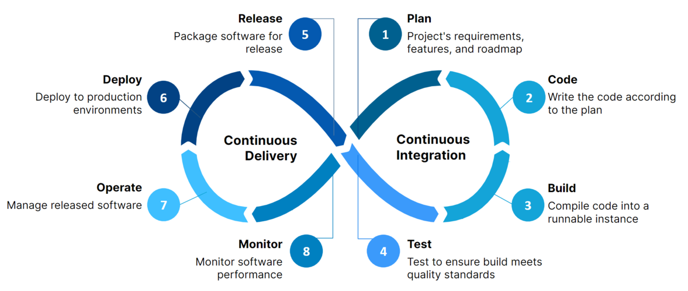
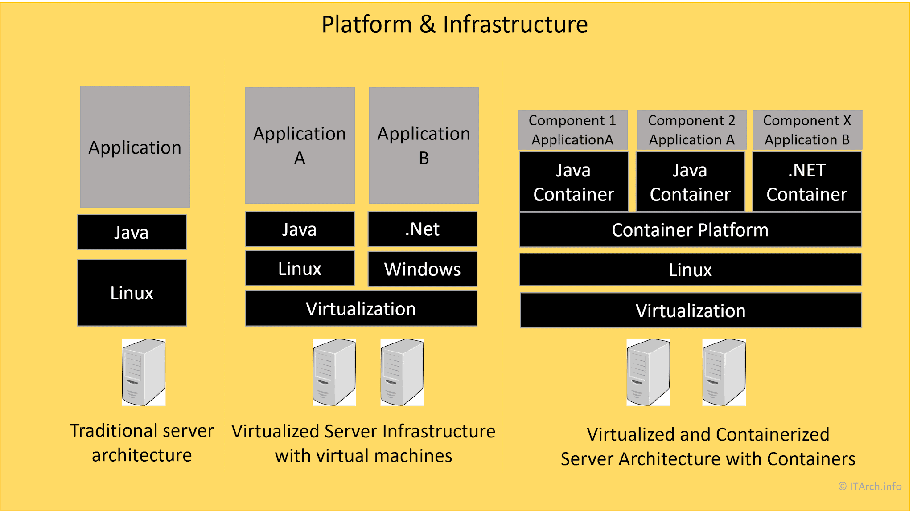
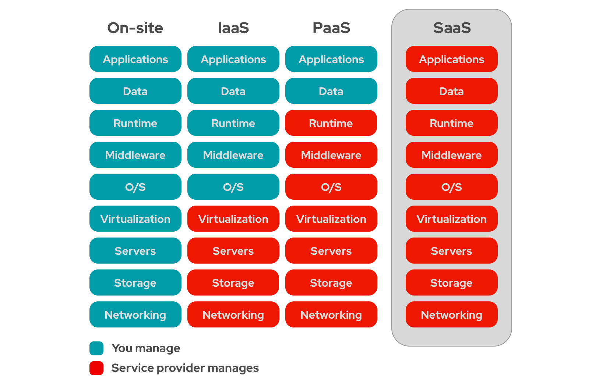

## I. 

lsof -i :3000:
    lsof stands for "List Open Files." It is a command-line utility used to display information about files opened by processes.
    The -i option specifies internet connections, and :3000 indicates that you are interested in the processes that are using port 3000.
Usage:
    This command will list all processes that are currently using port 3000, which is often used by web servers and development servers.
Example Output:
    COMMAND   PID USER   FD   TYPE DEVICE SIZE/OFF NODE NAME
    node    12345 user   12u  IPv4 0x12345      0t0  TCP *:3000 (LISTEN)
In this output, node is the command/process using port 3000, 12345 is the Process ID (PID), and it shows that it's listening on TCP.

netstat -an | grep 3000:
    netstat is a network statistics command-line tool that provides information about network connections, routing tables, interface statistics, masquerade connections, and multicast memberships.
    The -an options tell netstat to show all connections and listening ports in numeric form (showing IP addresses and port numbers instead of resolving hostnames).
The | grep 3000 part filters the output to only show lines that contain "3000."
Usage:
    This command is useful to quickly check if anything is listening on port 3000 or if there are any established connections to that port.
Example Output:
    tcp4       0      0  *.3000                 *.*                    LISTEN
This output indicates that there is a service listening on all network interfaces on port 3000.

sudo lsof -nP -iTCP:3000 | grep LISTEN:
This command is similar to the first one but includes additional options:
    sudo runs the command with superuser privileges, which may be necessary to see all processes.
    -n prevents lsof from converting network numbers to hostnames (to speed up the output).
    -P prevents conversion of port numbers to service names (to show raw port numbers).
    -iTCP:3000 specifies that you are only interested in TCP connections on port 3000.
Usage:
    This command will show all processes that are actively listening on TCP port 3000, providing detailed information in a format that is often easier to read and quicker to execute.
Example Output:
    COMMAND   PID USER   FD   TYPE DEVICE SIZE/OFF NODE NAME
    node    12345 user   12u  IPv4 0x12345      0t0  LISTEN
This confirms that the node process with PID 12345 is listening on TCP port 3000.

kill -9 1234:
    kill is a command used to terminate processes by their Process ID (PID).
    The -9 option sends the SIGKILL signal, which forces the process to terminate immediately.
Usage:
    This command is used when you want to forcefully stop a process that is not responding, or you cannot stop it using the normal kill command.
Example Usage:
    If you found that a process with PID 1234 is using port 3000 and you want to terminate it, you would run:
kill -9 1234
After issuing this command, the process with PID 1234 will be terminated immediately.

## II. CI/CD
 

Continuous Integration (CI):
    1. Plan: Project's requirements, features, adn roadmap
    2. Code: Write the code according to the plan
    3. Build: Compile code into a runnable instance (important to QA specialist)
    4. Test: Test to ensure build meets quality standards (important to QA specialist)
Continuous Delivery (CD):
    5. Release: Package software for release
    6. Deploy: Deploy to production environments (important to QA specialist)
    7. Operate: Manage release software
    8. Monitor: Monitor software performance

## III. Virtual machines
  

* IaaS - Infrastructure as a Service  
* PaaS - Platform as a Service  
* SaaS - Software as a Service 

  

 

## IV. Cypress run

[Cypress browser](https://docs.cypress.io/app/references/launching-browsers)  

 
[Cypress configuration](https://docs.cypress.io/app/references/configuration)

Clean git cache:

git rm -r -f --cached "directory, file name etc." 
git rm -r -f --cached ".code_examples/cyperss-demo/cypress/screenshots/" 
git rm -r -f --cached ".code_examples/cyperss-demo/cypress/screenshots/somefile.txt" 

